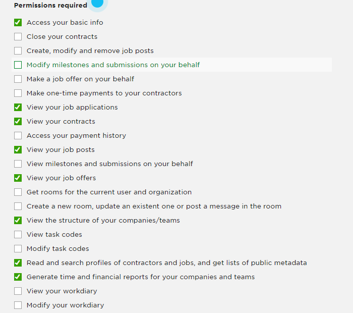
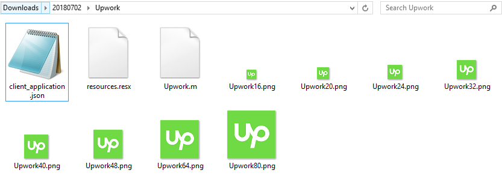
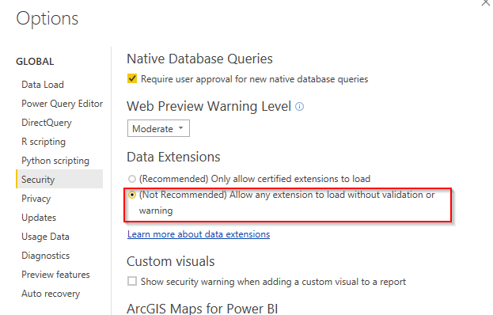
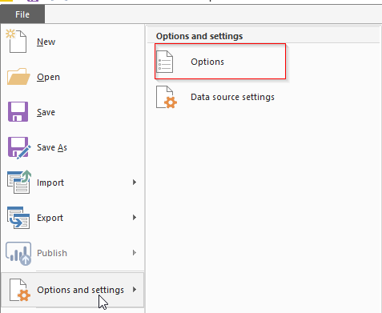
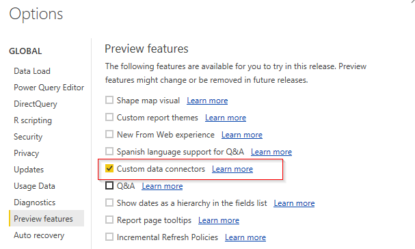
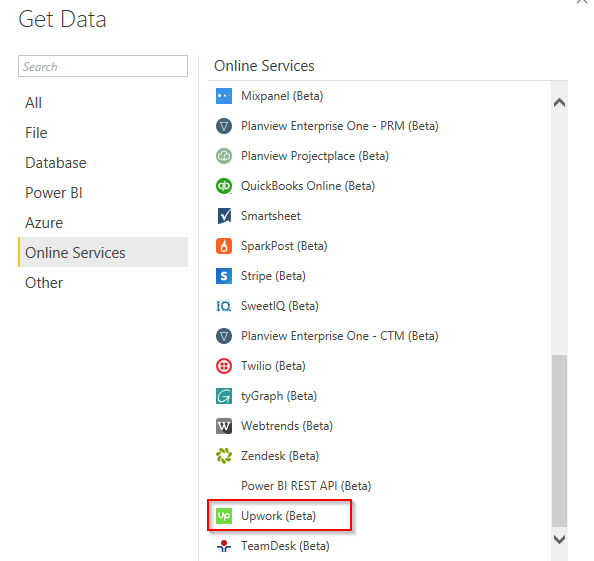
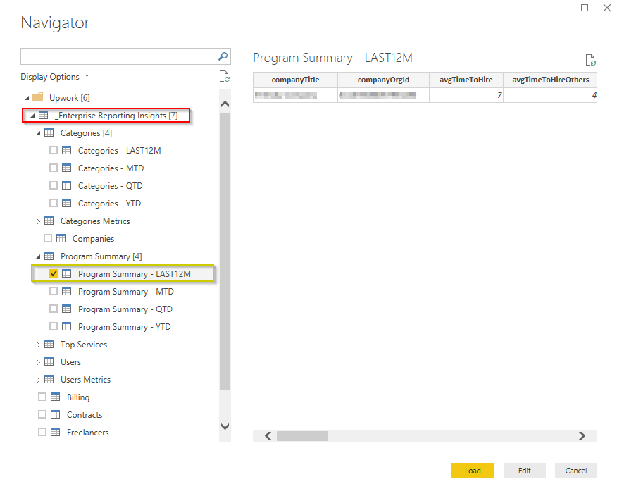
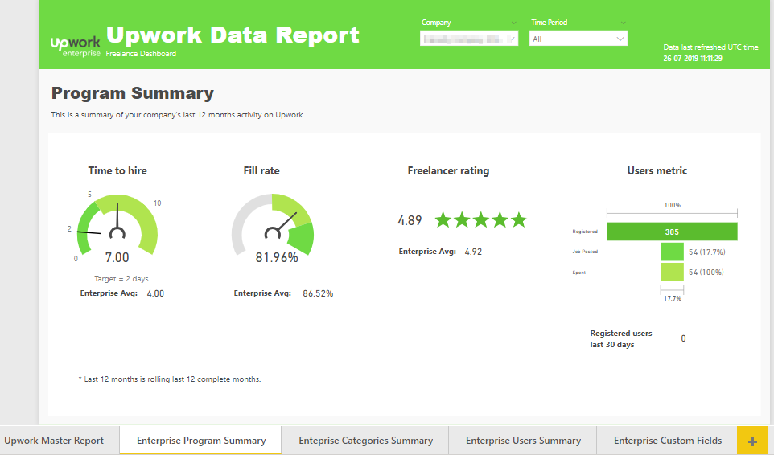
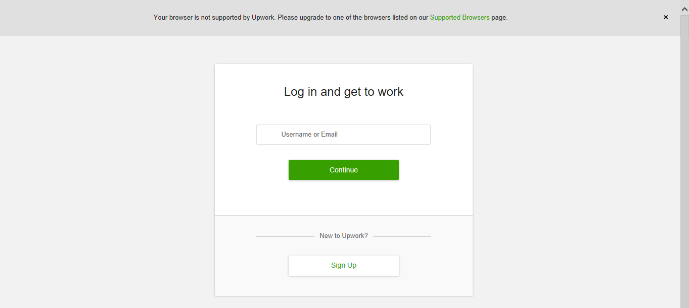

Introduction
============

The purpose of this **Power BI Custom Data Connector** is to connect to Upwork API and
pull data related to freelance projects. This custom data connector comes pre-packaged with a **Power BI Report** file to analyze your data quickly.

The connector connects to Upwork APIs using OAuth 2.0 protocol. Make sure you register an OAuth 2.0 client on Upwork before accessing data through this connector.

**Note 1:** Please check folder "build\dist_v1" in this repo for accessing the connector with OAuth 1.0, if you wish to. This build doesn't have any new features.

**Note 2:** Any enhancements/additions moving forward will be released with OAuth 2.0 support only.

**Note 3:** Recommended to use the pre-built, model ready template file "Upwork Report.pbit" under dist folder to pull and visualize data for your account

The connector pulls following data from Upwork API (Note: The data pulled from the connector is limited)

1.  Teams
2.  Jobs (including sub-teams)
3.  Contracts/Engagements
4.  Offers (newly added!)
5.  Freelancers
6.  Billing (Transactions)
7.  Milestones (for active contracts) (newly added!)
8.  Enterprise Reporting Insights (newly added!)
9.  Enterprise Custom Fields (newly added!) (fetches only last 3 years contracts CFs)

Release notes
=============
**Feb 2021**
1. Added Billing transaction notes column under Billing object

**Oct 2020**
1. Added additional columns in "Contract Hours" table
    Fetching contract hours worked data at date level granularity
2. Fixed bugs 

**June 2020**

1. Updated Custom Fields query to fetch only last 3 years contracts CFs.

**Feb 2020**

1. Offers. You can view your offer details including expected start/end dates, po number, talend cloud, contact person details, byo, w2 etc.
   
    New object added -> Offers

2. Milestones. You can now view milestones for your active contracts

    New object added -> Milestones

3. Contracts Extended. Contains feedback related to your contracts.

    New object added -> Contracts Extended

4. Added additional columns in:

    Contracts -> is_direct_hire

    Freelancers -> job_success_score_100, job_success_score, top_rated_status
    

**Dec 2019**
1. Billing object now has data at Transaction Id level. 

    New fields added -> txn_id, txn_date, type, accounting_subtype 

2. Added additional columns in Contracts and Freelancers Object

    Fields added:

    Contracts -> fixed_price_budget, hourly_charge_rate

    Freelancers -> total_hours, profile_hourly_rate

3. New object: Contract Hours

    To get number of hours worked in a contract

Setup instructions
==================

Follow steps below to setup and use the Upwork connector.

Step 1: Get access to Upwork REST API
======================================

Go to Upwork API request URL, fill out project details, and submit it
get your key approved. After the key is approved you can start pulling
data. Please find detailed steps:

1.  Go to URL: <https://www.upwork.com/services/api/apply> while logged
    into your Upwork account

2.  Provide project title and description

3.  Select Project type as **"Web Project"**

4.  Provide a call back URL:
    <https://oauth.powerbi.com/views/oauthredirect.html>

5.  Provide API Usage, you can select 500+ or 101-500

6.  Select Auth type as "OAuth 2.0"

7.  Select appropriate permissions. For this connector to work
    correctly, you need to select the following 8 permissions:

    

8.  For enterprise reporting to work you need to select an additional permission:
            
            Execute GQL Query under /graphql/

9.  Submit the application for approval

Once the keys are approved you need to update it in the connector.

Step 2: Download and Update Keys in the connector
==============================

Please follow steps below to download and update keys in the connector:

1.  In this GitHub repo, go to "dist" folder and download "Upwork.mez" and "Upwork_Report.pbit" file, and save it in your Desktop.

2.  Rename "Upwork.mez" file to "Upwork.zip"

3.  Unzip the contents

4.  Open client\_application file in Notepad or any other text file editor. Update "ClientId" with key or
    consumer key, and "ClientSecret" with the secret of your key. Save the file after updates.

    a.  Note: to obtain your API Key and Secret, navigate to the link below:

        i.  <https://www.upwork.com/services/api/keys>

5.  Zip the contents of the folder and rename zip to
    .mez

    a.  Note: Ensure that you are repackaging only the content files
        (screenshot below) into a new .zip folder, not the parent folder
        and its sub-components.
        
    b. Note: A Windows machine must be used to create the zip file.

    
    
     
Step 3: Place the connector file (.mez)
=========================
After you have updated the connector file above, copy the .mez file and place it under
**C:\Users\\<Your_User_Name>\\Documents\\Microsoft Power BI Desktop\Custom Connectors** folder. 

Create the folders if they do not exist.

Step 4: Enable security options in Power BI
=========================

If you are using Power BI Desktop version Oct 2018 or more, then follow the instructions below:

1. Open a blank Power BI Desktop file
2. Go to File->Options and settings->Options, and select "(Not Recommended)...." under Data Extensions. See screenshot below.

3. Restart Power BI Desktop to take effect.

However, if you are using an older version (Sep 2018 or less), then follow the instructions below:

1. Open a blank Power BI Desktop file
2. Go to File->Options and settings->Options. Under "Preview features" select "Custom data connectors".

Refer to the screenshot below. 

3. Restart Power BI Desktop to take effect.

Step 5: Load data
=========

You are now set to pull data from Upwork. If everything is setup correctly, you will see Upwork connector inside Online Services under Get Data. See screenshot below:

Remember, you had saved "Upwork.mez" and "Upwork_Report.pbit" file in your Desktop? It's time to use the pbit file.

Double click on the "Upwork_Report.pbit" file and follow along to load a fully comprehensive report of your freelance projects. 

Enterprise Reporting Insights
=========
If you are an enterprise using Upwork, you can view additional insights of your engagement on Upwork right within Power BI.

Following enterprise views have been added in this connector.

1.  **Program summary** - A summary of your engagement on Upwork. Metrics include avg time to hire, avg fill rate, avg FL rating, total users, active users for your company. The metrics also include avg across enterprises so you can benchmark your engagement.

2.  **Categories metrics and summary** - Metrics and summary for job posted categories including active categories, avg project cost, and drilldown at a category level. The drilldown metrics include spend, avg time to hire, avg project cost and others.

3.  **Users metrics and summary** - Metrics and summary for your users/hiring managers. Metrics include total users, active users, and drilldown at a user level. The drilldown metrics include spend, fill rate, hiring manager name, jobs posted, days since registration and others. 

4. **Custom Fields** - Get custom fields and values for your contracts.

These new views are available in the connector. Refer to the screenshot below. You can pull data for following time periods: MTD, QTD, YTD, or LAST 12 M (last complete 12 months).

Power BI Report file
=========
The Power BI Report file that comes packaged with this connector shows a comprehensive view of your freelance projects and enterprise reporting insights. 

The report provides a trend of the amount spent on the platform for your contracts, avg. spend on contracts, and spend by job category and sub category.

It also includes the distribution of hourly and fixed price contracts, active and closed contracts, and avg. contract duration in days.

On freelancers information, the report provides freelancers' geographic distribution, agency vs freelancers proposition, # freelancers and # contracts by job category, and avg. time to hire on this platform for your teams.

The report comes with two filters: Team and Job Category. The report also provides you a timestamp of when the data was last refreshed.

After you have set up the Upwork custom connector as described above, you may publish this report in your Power BI tenant and setup refreshes so you have more visibility in your freelance contracts.

A snippet of this Power BI Report from our test account is attached below.

If you are an enterprise, you can pull additional views of your engagement on Upwork. The Power BI report template file pulls last 12 months of data for your program, categories and users.
Here's a snippet of the enterprise program summary report page from our test account.

Troubleshoot
=========
1. **I cannot see "Upwork" custom connector in Get Data.**

    The most common cause for this problem is the users have not enabled security options in Power BI. Refer to the above section on how to enable this option.
    
    Another reason could be, you have not zipped the "contents" of the Upwork folder. You need to zip only the contents and not the parent folder after you have added your keys and secret.

2. **I cannot see some of my freelance contracts**

    The data in the connector is pulled based on your Upwork account permissions. You will be seeing only the contracts for teams for which you have permissions.

    If you are an enterprise, you may need to contact your enterprise manager to update your account permissions, or else contact Upwork support.

3. **Which ID should I login with in this connector?**

    You need to login with the Upwork account in which you have access to the Upwork data. 

    Currently, we do not have options to combine data from multiple accounts in this custom connector.

4. **I see billing only from Jan 2018**

    The billing data is currently being pulled only from Jan 2018. 

5. **Whom to contact if I have further questions?**

    The best way is to open an issue in Github. Our developers will respond to you as soon as possible.

6. **I get unsupported browser error**
You may get unsupported browser error when authenticating with Upwork. Please ignore this error.

7. **How do I setup refreshes on PowerBI.com?**
    We highly recommend using [Power BI On-premises data gateway](https://powerbi.microsoft.com/en-us/gateway/) (non-personal mode) for setting up refreshes.
